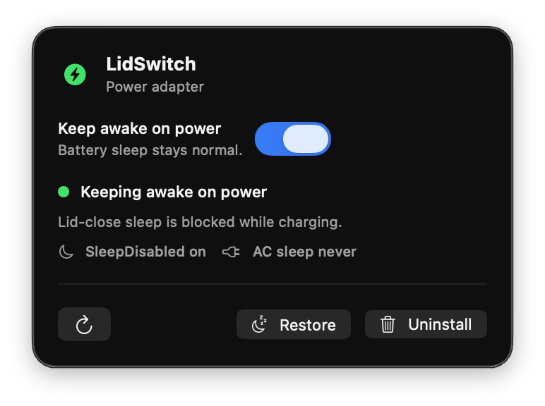

# LidSwitch

Close the lid. Let the job finish.

LidSwitch is a minimal native macOS menu bar app for Apple Silicon MacBooks with one job: keep a plugged-in MacBook awake when the lid is closed. It defaults to the safer AC-only mode and includes an explicit battery opt-in for users who need processing to continue while unplugged.



## Public Preview

The landing page lives in `site/` and is configured for Vercel.

Run it locally:

```bash
npm install
npm run site:serve
```

Then open:

```text
http://127.0.0.1:4173
```

The public launch copy is intentionally explicit: LidSwitch is a free manual DMG,
not a Mac App Store app, not notarized, and may require **Open Anyway** approval
in macOS Security settings.

## Download

Release DMGs should be attached to GitHub Releases. The current release build is for Apple Silicon Macs. Build one locally with:

```bash
./script/build_dmg.sh
```

This writes `dist/LidSwitch.dmg` and `dist/LidSwitch.dmg.sha256`. See
[Install](docs/INSTALL.md) and [Distribution](docs/DISTRIBUTION.md) for the
manual approval and release checklist.

Validate the release artifact with:

```bash
./script/validate_dmg.sh
```

## What It Does

- Adds a compact `MenuBarExtra` with one primary switch: **Keep awake when plugged in**.
- Adds a secondary **Allow on battery** switch that stays off unless explicitly enabled.
- Shows live power source and sleep-override state.
- Enables `SleepDisabled` only when the app is enabled and macOS reports AC Power.
- Automatically clears `SleepDisabled` on battery unless both switches are enabled.
- Warns clearly when the Mac is on battery and lid-close sleep is still allowed.
- Provides **Restore** and **Uninstall** controls from the menu bar panel.
- Uses the standard macOS administrator prompt for privileged helper install, restore, and uninstall.

## Safety Model

macOS exposes `disablesleep` as a system-wide power flag, not as a clean AC-only preference. LidSwitch handles that by installing a small root LaunchDaemon helper that polls the current power source and a user-owned desired-state file.

The helper behavior is intentionally conservative:

- If keep-awake is enabled and power source is AC: set AC idle sleep to `0` and set `SleepDisabled` to `1`.
- If keep-awake is enabled, battery opt-in is enabled, and power source is battery: set battery idle sleep to `0` and set `SleepDisabled` to `1`.
- If power source is battery and battery opt-in is disabled: set `SleepDisabled` to `0`.
- If keep-awake is disabled: set `SleepDisabled` to `0` and restore saved AC and battery idle-sleep values if LidSwitch saved them.

The app never stores credentials. It delegates privileged work to macOS via the normal authorization dialog.

## Requirements

- Apple Silicon Mac
- macOS 14 or newer
- Apple Swift toolchain / Xcode command line tools
- Accessibility permission for validation scripts that inspect the menu bar UI
- Administrator access for first install, restore, and uninstall actions

## Build And Run

Use the project runner:

```bash
./script/build_and_run.sh
```

Verify launch:

```bash
./script/build_and_run.sh --verify
```

The runner builds the SwiftPM executable, stages a local app bundle at:

```text
${TMPDIR}/lidswitch-app/LidSwitch.app
```

and launches it as a real macOS app bundle rather than a raw executable.
Use `LIDSWITCH_APP_STAGE_ROOT` or `LIDSWITCH_APP_BUNDLE` to override that path.
The app is staged outside the repository so macOS FileProvider metadata from
Documents/iCloud folders cannot corrupt codesign verification.

## Test

Run unit tests:

```bash
swift test
```

Validate the landing page:

```bash
npm install
npm run validate:site
```

Run the release-oriented local checks:

```bash
npm run scan:secrets
./script/build_dmg.sh --dry-run
./script/validate_dmg.sh
```

For native changes, also run `swift build`, `swift test`, and
`./script/build_and_run.sh --verify`. For installed-helper changes, run
`./script/validate_live_state.sh` on a Mac where LidSwitch is installed and
enabled.

## Installed Files

When enabled for the first time, LidSwitch installs:

```text
/Library/LaunchDaemons/com.johnsilva.lidswitch.helper.plist
/Library/Application Support/LidSwitch/lidswitch-helper
/Library/Application Support/LidSwitch/helper-version
/Library/Application Support/LidSwitch/original-ac-sleep
/Library/Application Support/LidSwitch/original-battery-sleep
~/Library/Application Support/LidSwitch/desired-state
```

The root-owned files are removed by **Uninstall**. The desired-state file is user-owned and stores only the keep-awake mode and battery opt-in:

```text
mode=enabled
battery=disabled
```

Legacy `enabled` and `disabled` files still read safely; legacy `enabled` means AC-only.

## Local Verification Notes

The implementation was verified on macOS 26.3 with the app enabled while connected to AC power:

- `SleepDisabled 1`
- desired state `mode=enabled`, `battery=disabled`
- LaunchDaemon loaded as `com.johnsilva.lidswitch.helper`
- battery power profile preserved with `sleep 1`
- menu bar UI showed `Keeping awake when plugged in` and the battery opt-in control

Those checks are environment-specific. Re-run the commands above on the release
machine before publishing a new DMG.

## More Documentation

- [Architecture](docs/ARCHITECTURE.md)
- [Install](docs/INSTALL.md)
- [Operations](docs/OPERATIONS.md)
- [Privacy And Safety](docs/PRIVACY.md)
- [Security Policy](SECURITY.md)
- [Distribution](docs/DISTRIBUTION.md)
- [Validation](docs/VALIDATION.md)
